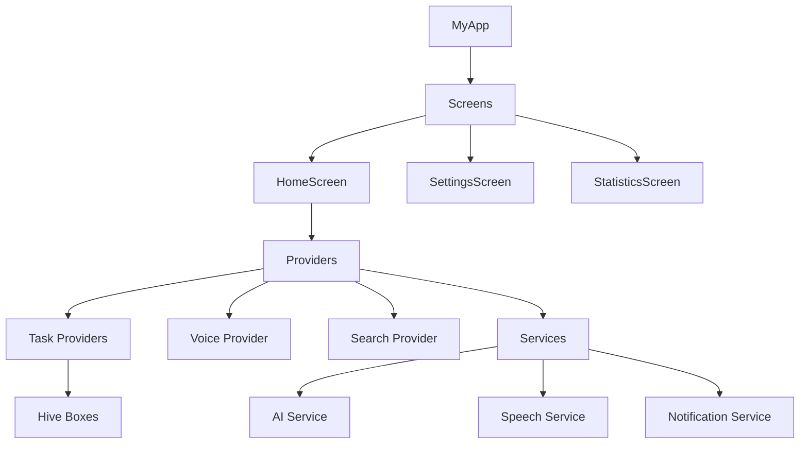

# Y0 To-Do App


## نظرة عامة
Y0 To-Do App هو تطبيق إدارة مهام ذكي باللغة العربية أولاً، مع اقتراحات مدعومة بالذكاء الاصطناعي، وإدخال صوتي باللغة العربية، وتصفية متقدمة. يجمع بين واجهة عصرية وإدارة حالة Riverpod والتخزين المحلي باستخدام Hive لسرعة وأداء بدون اتصال.

## Screenshots
> Add screenshots under `assets/` and reference them here.

## المميزات
- ✅ **تصميم Neo-morphic متطور**: واجهة حديثة مع تأثيرات ثلاثية الأبعاد وظلال واقعية
- ✅ **شاشة إحصائيات متكاملة**: عرض تفصيلي للأداء مع رسوم بيانية تفاعلية
- ✅ **وضع ليلي مخصص**: ألوان متكيفة للوضع الليلي مع أفضل تجربة مستخدم
- ✅ **تحليل المهام بالذكاء الاصطناعي**: الأولوية، التصنيف، اقتراحات الموعد
- ✅ **إدخال صوتي بالتعرف على الكلام العربي**: دعم كامل للغة العربية
- ✅ **اقتراحات ذكية بناءً على المهام الحديثة**: تعلم من سلوك المستخدم
- ✅ **فلاتر متقدمة**: الحالة، الأولوية، التصنيف، التاريخ
- ✅ **بحث مع سجل + نتائج فورية**: بحث سريع وفعال مع فلترة فورية
- ✅ **إشعارات محلية + جدولة**: تعمل حتى لو التطبيق مقفول
- ✅ **رسوم متحركة سلسة مع ردود فعلية لمسية**: تجربة مستخدم مميزة
- ✅ **متوافق مع جميع أجهزة Android**: بما فيها Samsung Galaxy
- ✅ **نظام تنقل متطور**: انتقال سلس بين الشاشات بدون زر العودة
- ✅ **شريط تنقل سفلي موحد**: تنقل سهل بين جميع الشاشات

## الجديد في الإصدار v3.2.3
- 📄 **إضافة LICENSE**: إضافة MIT License رسمي للمشروع
- 🔧 **تحسين جودة الكود**: إزالة الدوال غير المستخدمة ومعالجة جميع TODOs
- 🎯 **تنفيذ منطق الحفظ**: تحسين وظيفة الحفظ في neo_morphic_task_dialog
- ✅ **خلو من الأخطاء**: flutter analyze يظهر "No issues found!"
- 📝 **تحسين التوثيق**: تحويل TODOs إلى ميزات اختيارية مع تعليقات واضحة

## الجديد في الإصدار v3.2.2
- 🔍 **تحسين البحث**: إعادة تصميم شريط البحث مع وظيفة البحث الفعلي والفلترة الفورية
- 🎯 **تحسين واجهة تعديل المهمة**: تغيير اختيار الأولوية إلى أزرار سهلة الاستخدام
- 🌙 **إصلاح الوضع الليلي**: تحسين لون خلفية شاشة تعديل المهمة في الوضع الليلي
- 🧭 **تحسين التنقل**: إزالة زر العودة من جميع الشاشات الرئيسية
- 📱 **شريط تنقل موحد**: إضافة شريط تنقل سفلي إلى شاشة الإعدادات
- 🎨 **تنظيف الواجهة**: إزالة علامات الملف الشخصي غير المستخدمة
- 📊 **تحسين الإحصائيات**: إزالة قسم التقرير الشهري (قيد التطوير)

## الجديد في الإصدار v3.2.1
- 🎨 **تصميم Neo-morphic بالكامل**: إعادة تصميم كامل للواجهة مع تأثيرات ثلاثية الأبعاد وظلال واقعية
- 📊 **شاشة إحصائيات متكاملة**: شاشة جديدة مع رسوم بيانية تفاعلية وتحليلات مفصلة للأداء
- 🌙 **وضع ليلي مخصص**: تحسين شامل للوضع الليلي مع ألوان متكيفة وتجربة مستخدم محسّنة
- 🧭 **نظام تنقل متطور**: تحسين انتقال الشاشات مع routing موحد وإدارة أفضل للمسارات
- 🔧 **تحسينات الأداء**: إصلاح مشاكل الـ routing وتحسين استقرار التطبيق
- 📱 **توافق محسّن**: تحسين التوافق مع مختلف أحجام الشاشات والأجهزة
- 🎯 **واجهة مستخدم محسّنة**: تحسينات في التفاعل والرسوم المتحركة والتجربة العامة

## الإصلاحات الأخيرة (v3.1.0)
- 🚀 **تحديث البيئة البرمجية**: ترقية Java إلى إصدار 17 وتحديث JVM Target لتحسين أداء بناء التطبيق واستقراره.
- 🔧 **حل مشكلة Kotlin Daemon**: إصلاح أخطاء البناء المتعلقة بـ `Daemon compilation failed` وتعارض ملفات الكاش.
- 🛠️ **تحسين استقرار المكتبات**: تحديث `package_info_plus` و `device_info_plus` لضمان التوافق الكامل مع أحدث إصدارات Android.
- 📝 **تحديث التوثيق**: تحديث دليل التشغيل والـ README ليعكس التغييرات التقنية الجديدة.

## الإصلاحات السابقة (v2.3.2)
- 🎨 **تحسينات Dark Mode**: إصلاح ألوان الفلاتر والنصوص في الوضع الليلي.
- 🎯 **تحسين تجربة المستخدم**: توحيد الألوان في جميع الفلاتر (الحالة، الأولوية، التصنيف، التاريخ).
- 📱 **إصلاح الشاشات الصغيرة**: تحسين عرض الفلاتر النشطة في الأجهزة ذات الشاشات المحدودة.
- 🔧 **استقرار التطبيق**: تحسين معالجة الأخطاء وزيادة الاستقرار العام.

## الإصلاحات السابقة (v2.2.6-2.2.8)
- 🔧 إصلاح انهيار التطبيق عند بدء التشغيل على الأجهزة الحقيقية
- 🔧 حل مشكلة الإشعارات على هواتف Samsung Galaxy
- 🔧 إصلاح خطأ type cast في إعدادات التطبيق
- 🔧 تحسين استقرار البحث والاقتراحات الذكية
- 🔧 إضافة صلاحيات الميكروفون للإدخال الصوتي

## Tech Stack
| Layer | Technology |
| --- | --- |
| UI | Flutter (Material 3 + Neo-morphic Design) |
| State | Riverpod |
| Storage | Hive |
| Voice | Speech/TTS services |
| Charts | fl_chart |
| Animations | flutter_animate + Lottie |
| Navigation | Named Routes + Material Router |

## Architecture
For detailed diagrams and data flow, see [ARCHITECTURE.md](ARCHITECTURE.md).



## Requirements
- Flutter SDK 3.x
- Dart SDK (bundled with Flutter)
- Android Studio / VS Code with Flutter plugins
- Android/iOS device or emulator

## Setup
```bash
flutter pub get
flutter pub run build_runner build --delete-conflicting-outputs
```

## Run
```bash
flutter run
```

## Tests
```bash
flutter test --coverage
```

## Quality Metrics
| Metric | Target |
| --- | --- |
| Test coverage | ≥ 70% |
| Linting | 0 analyzer errors |
| Accessibility | Semantics labels on interactive UI |

## Contributing
See [CONTRIBUTING.md](CONTRIBUTING.md) for guidelines and workflow.

## استكشاف الأخطاء وإصلاحها

### مشاكل شائعة وحلولها

#### 1. التطبيق لا يعمل على الهاتف الحقيقي
**المشكلة:** التطبيق ينهار عند التثبيت على الهاتف
**الحل:** امسح بيانات التطبيق القديمة قبل الترقية، أو قم بإلغاء التثبيت وإعادة التثبيت

#### 2. الإشعارات لا تعمل على Samsung Galaxy
**المشكلة:** الإشعارات لا تصل عندما يكون التطبيق مقفول
**الحل:**
- اذهب إلى الإعدادات > البطارية > استخدام البطارية > Y0 To-Do App > "عدم تقييد"
- اذهب إلى الإعدادات > التطبيقات > Y0 To-Do App > البطارية > "غير مقيد"
- اذهب إلى الإعدادات > التطبيقات > خاصة > إذن الدقة العالية > فعّل للتطبيق

#### 3. الميكروفون لا يعمل
**المشكلة:** رسالة "لم يتم منح إذن الميكروفون"
**الحل:**
- اذهب إلى الإعدادات > التطبيقات > Y0 To-Do App > الصلاحيات
- فعّل "الميكروفون" و"تسجيل الصوت"

#### 4. خطأ في البناء (Daemon compilation failed)
**المشكلة:** فشل بناء التطبيق مع رسائل خطأ تتعلق بـ Kotlin أو Java.
**الحل:** تم حل المشكلة في v3.1.0 عبر الترقية لـ Java 17. تأكد من ضبط `JAVA_HOME` على الإصدار 17 أو أعلى في جهازك.

#### 5. مشاكل التنقل بين الشاشات
**المشكلة:** التطبيق ينهار عند الانتقال بين الشاشات
**الحل:** تم حل المشكلة في v3.2.1 عبر تحسين نظام الـ routing. تأكد من استخدام أحدث إصدار.

#### 6. مشاكل في الوضع الليلي
**المشكلة:** الألوان غير واضحة في الوضع الليلي
**الحل:** تم تحسين الوضع الليلي بالكامل في v3.2.1 مع ألوان متكيفة وتجربة مستخدم محسّنة.

### المتطلبات التقنية
- Android 5.0 (API 21) أو أعلى
- 50MB مساحة تخزين
- صلاحيات: الإشعارات، الميكروفون، التخزين
