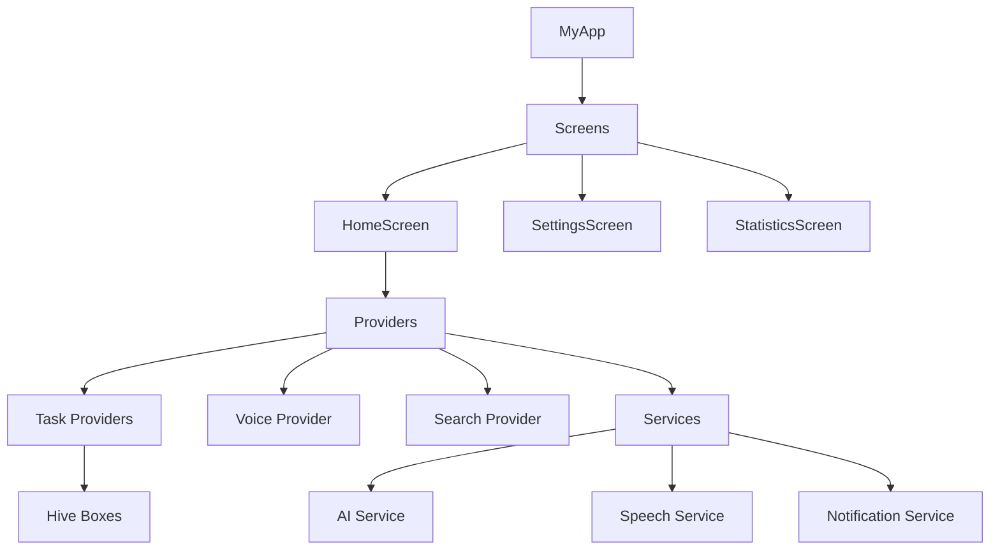

# Y0 To-Do App


## Overview
Y0 To-Do App is a smart, Arabic-first task manager with AI-assisted suggestions, voice input, and rich filtering. It pairs a modern UI with Riverpod state management and Hive persistence for fast, offline-first usage.

## Screenshots
> Add screenshots under `assets/` and reference them here.

## Features
- ✅ AI-assisted task analysis (priority, category, due date hints)
- ✅ Voice input with Arabic speech recognition
- ✅ Smart suggestions based on recent tasks
- ✅ Advanced filters (status, priority, category, date)
- ✅ Search with history + instant results
- ✅ Local notifications + scheduling
- ✅ Smooth animations and haptics

## Tech Stack
| Layer | Technology |
| --- | --- |
| UI | Flutter (Material 3) |
| State | Riverpod |
| Storage | Hive |
| Voice | Speech/TTS services |
| Animations | flutter_animate + Lottie |

## Architecture
For detailed diagrams and data flow, see [ARCHITECTURE.md](ARCHITECTURE.md).



## Requirements
- Flutter SDK 3.x
- Dart SDK (bundled with Flutter)
- Android Studio / VS Code with Flutter plugins
- Android/iOS device or emulator

## Setup
```bash
flutter pub get
flutter pub run build_runner build --delete-conflicting-outputs
```

## Run
```bash
flutter run
```

## Tests
```bash
flutter test --coverage
```

## Quality Metrics
| Metric | Target |
| --- | --- |
| Test coverage | ≥ 70% |
| Linting | 0 analyzer errors |
| Accessibility | Semantics labels on interactive UI |

## Contributing
See [CONTRIBUTING.md](CONTRIBUTING.md) for guidelines and workflow.
