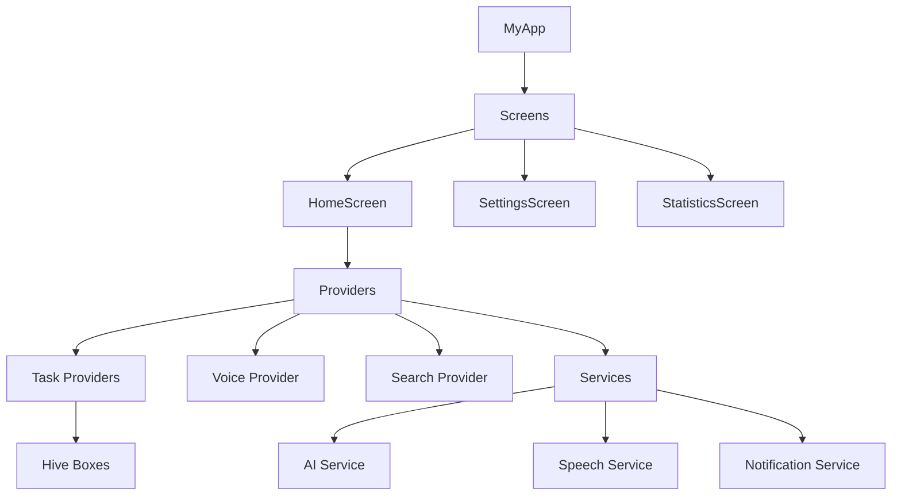

# Y0 To-Do App


## نظرة عامة
Y0 To-Do App هو تطبيق إدارة مهام ذكي باللغة العربية أولاً، مع اقتراحات مدعومة بالذكاء الاصطناعي، وإدخال صوتي باللغة العربية، وتصفية متقدمة. يجمع بين واجهة عصرية وإدارة حالة Riverpod والتخزين المحلي باستخدام Hive لسرعة وأداء بدون اتصال.

## Screenshots
> Add screenshots under `assets/` and reference them here.

## المميزات
- ✅ تحليل المهام بالذكاء الاصطناعي (الأولوية، التصنيف، اقتراحات الموعد)
- ✅ إدخال صوتي بالتعرف على الكلام العربي
- ✅ اقتراحات ذكية بناءً على المهام الحديثة
- ✅ فلاتر متقدمة (الحالة، الأولوية، التصنيف، التاريخ)
- ✅ بحث مع سجل + نتائج فورية
- ✅ إشعارات محلية + جدولة
- ✅ رسوم متحركة سلسة مع ردود فعلية لمسية

## Tech Stack
| Layer | Technology |
| --- | --- |
| UI | Flutter (Material 3) |
| State | Riverpod |
| Storage | Hive |
| Voice | Speech/TTS services |
| Animations | flutter_animate + Lottie |

## Architecture
For detailed diagrams and data flow, see [ARCHITECTURE.md](ARCHITECTURE.md).



## Requirements
- Flutter SDK 3.x
- Dart SDK (bundled with Flutter)
- Android Studio / VS Code with Flutter plugins
- Android/iOS device or emulator

## Setup
```bash
flutter pub get
flutter pub run build_runner build --delete-conflicting-outputs
```

## Run
```bash
flutter run
```

## Tests
```bash
flutter test --coverage
```

## Quality Metrics
| Metric | Target |
| --- | --- |
| Test coverage | ≥ 70% |
| Linting | 0 analyzer errors |
| Accessibility | Semantics labels on interactive UI |

## Contributing
See [CONTRIBUTING.md](CONTRIBUTING.md) for guidelines and workflow.
